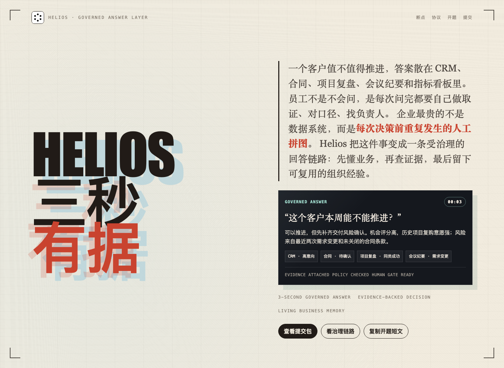

<p align="center">
  
</p>

<h1 align="center">Helios</h1>

<p align="center">
  <strong>一句话，把企业数据编译成可追溯的 AI 工作流。</strong>
</p>

<p align="center">
  <a href="https://duang777.github.io/helios/">在线展示</a>
  ·
  <a href="https://duang777.github.io/helios/console/">控制台预览</a>
  ·
  <a href="docs/architecture.md">架构说明</a>
</p>

<p align="center">
  
  
  
  
  
</p>

<p align="center">
  <code>AI Agents</code>
  ·
  <code>Workflow DAG</code>
  ·
  <code>Runtime Adapter</code>
  ·
  <code>Evidence Ledger</code>
  ·
  <code>Enterprise Data Governance</code>
</p>

<p align="center">
  
</p>

Helios is a Go-native AI Workflow Compiler for business operations. It turns a natural-language business goal into an executable workflow, scoped agent roles, runtime adapter contracts, generated app surfaces, evidence records, and an auditable run history.

Live demo: `https://duang777.github.io/helios/`

Challenge direction: 企业级业务能力沉淀 Agent，让业务人员通过自然语言创建、调用和迭代 Agent，把数据、流程、权限和经验沉淀为可复用的组织能力。

Supplemental materials for the opening report:

- [补充材料索引](docs/supplemental/README.md)
- [开题报告补充材料](docs/supplemental/01-opening-report-supplement.md)
- [相关项目经验](docs/supplemental/02-project-experience.md)
- [数据分析样本](docs/supplemental/03-data-analysis-sample.md)
- [研究笔记](docs/supplemental/04-research-notes.md)
- [参考资料清单](docs/supplemental/05-reference-list.md)
- [附件打包下载](docs/supplemental/helios-supplemental-materials.zip)

The project is a general-purpose workflow kernel first. The current scenario shell applies the kernel to enterprise data governance: customer insight, project review, contract risk, operating metrics, evidence-led answers, and business-side Agent creation.

## Positioning

Helios is inspired by the broader category of AI automation platforms, but it is not a Go port of any existing product. The implementation focuses on a lightweight enterprise runtime:

- Single-binary Go deployment for private environments.
- A small DAG executor built with plain Go concurrency primitives.
- Contract-first REST APIs for workflow compilation and runs.
- Role-scoped agent tasks instead of one global chat context.
- Runtime adapter boundaries for Codex Runtime, Claude, local tools, browser automation, MCP tools, approval gates, and evidence storage.
- Evidence ledger and run audit as first-class product surfaces.
- Template-driven mini apps for forms, approvals, reports, and dashboards.

## MVP Scope

- Compile one chat-style business request into workflow JSON.
- Persist workflow runs in memory for local demo use.
- Execute deterministic MVP node types: `llm_task`, `form`, `approval`, `human_task`, `report`, and `dashboard`.
- Show the Helios product loop in Chinese: chat builder, rendered node canvas, generated app preview, scoped agent panel, runtime adapter table, metrics, evidence ledger, and report summary.
- Ship an enterprise data governance sample for customer insight, project review, contract risk, and evidence-led operating decisions.

The MVP runtime is deterministic and does not pretend to call external model providers without configured adapters. The compiled workflow explicitly marks adapter contracts such as `codex_runtime`, `claude`, `local_tools`, `human_gate`, and `audit_store` so real providers can be connected without changing the public API shape.

## Repository Layout

```text
backend/  Go workflow compiler, runtime, API, tests
web/      Vite React operation console
docs/     Product notes, architecture, and reference records
```

## Local Development

Backend:

```bash
cd backend
go test ./...
go run ./cmd/helios
```

Frontend:

```bash
cd web
npm install
npm run dev
```

By default, the frontend calls `http://localhost:8080/api`.
