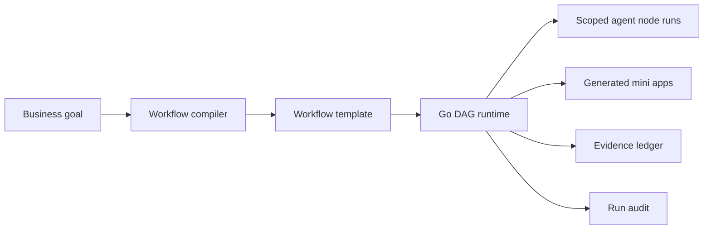

# Helios Architecture

## Core Idea

Helios compiles a natural-language business goal into an executable workflow asset:

## Backend Modules

- `domain`: Stable workflow, run, node, agent, evidence, artifact, and mini-app types.
- `compiler`: Deterministic MVP compiler from goal text to workflow template.
- `runtime`: DAG executor that runs nodes when dependencies are satisfied.
- `store`: In-memory persistence for demo and tests.
- `httpapi`: REST API boundary and validation.

## API Contract

- `GET /api/health`
- `POST /api/workflows/compile`
- `POST /api/workflows/{workflowId}/runs`
- `GET /api/runs/{runId}`

## MVP Execution Semantics

The MVP runtime executes nodes deterministically so the platform is demoable without external AI keys. AI providers should later plug in behind a compiler/executor interface without changing public API response shapes.

## Scenario Shell

`SKUFlow` packages the generic kernel for a MINISO-style new product development process:

1. Trend insight
2. Product idea framing
3. Competitor analysis
4. Supply chain validation
5. Launch test
6. Review decision

